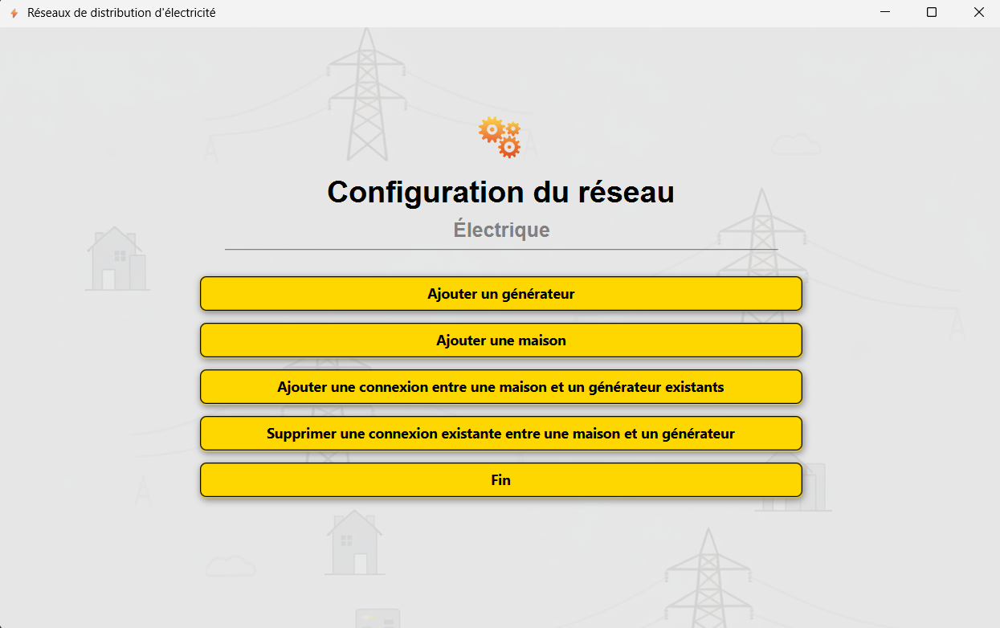
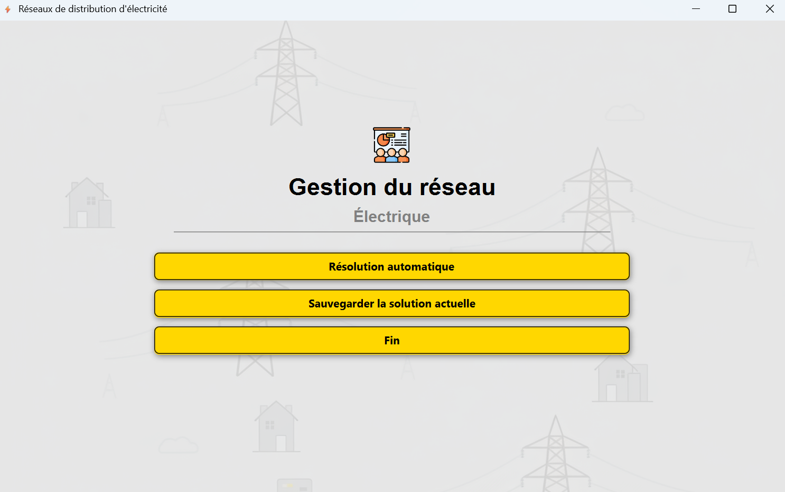
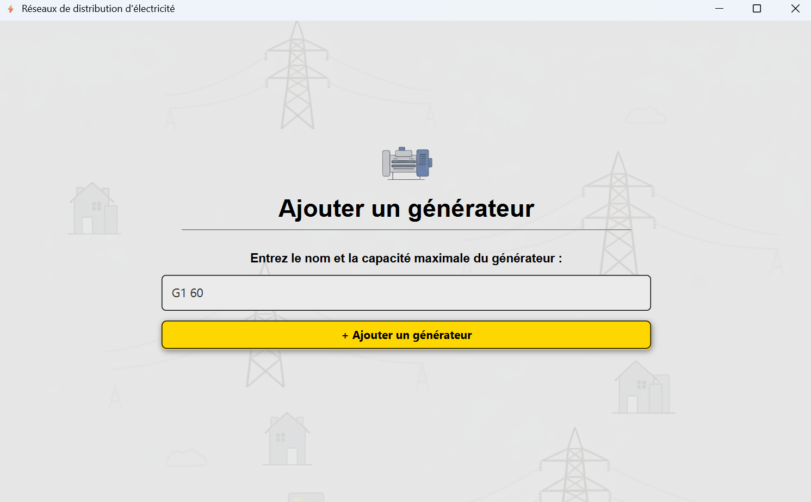
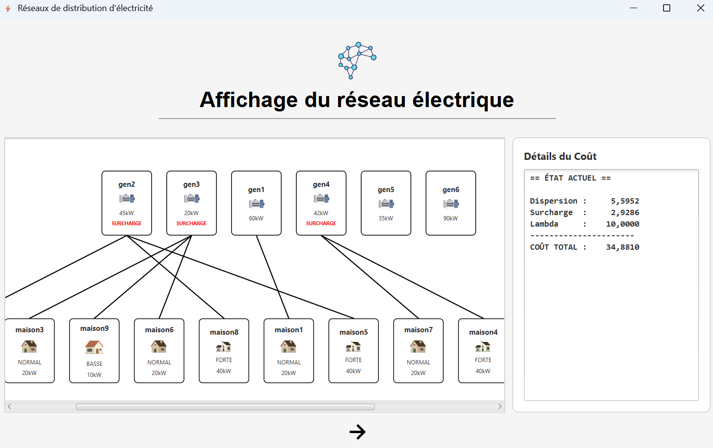

# Projet Réseau Électrique

Ce projet est réalisé dans **le cadre du cours de Programmation Avancée** en troisième année de **Licence Informatique à l’Université Paris Cité**, campus Saint-Germain-des-Prés.

Il s’agit d’une **application en Java permettant de modéliser, de visualiser et d’optimiser un réseau de distribution électrique**. Le système gère des générateurs d'électricité, des maisons avec différents niveaux de consommation et optimise automatiquement les connexions pour minimiser le coût total du réseau.

## Documentation du Projet
Pour une meilleure compréhension et utilisation du projet, veuillez consulter les documents suivants :

* **[Présentation du Projet (PDF)](./presentation_projet.pdf)** : Vue d'ensemble et objectifs.
* **[Projet - Partie 1](./projet_partie1.pdf)** : Spécifications initiales.
* **[Projet - Partie 2](./projet_partie2.pdf)** : Détails techniques et avancés.

## Captures d’écran

<div style="display: flex-wrap: wrap-row;">
  
  
  
  

## Arborescence du projet
```
projet-paa-reseau/
├───.settings
├───bin
│   └───up
│       └───rde
│           ├───fichier
│           ├───main
│           ├───modele
│           ├───ui
│           │   ├───composants
│           │   └───fenetres
│           │       ├───affichage
│           │       ├───configuration
│           │       └───gestion
│           └───utilitaire
├───exemples
├───ressources
│   └───maquettes
│   └───capture_ecran
├───src
│   └───up
│       └───rde
│           ├───fichier
│           ├───main
│           ├───modele
│           ├───ui
│           │   ├───composants
│           │   └───fenetres
│           │       ├───affichage
│           │       ├───configuration
│           │       └───gestion
│           └───utilitaire
└───test
│   └───up
│       └───rde
│           ├───fichier
│           ├───modele
│           └───utilitaire
├───demonstration.mp4
├───projet_partie1.pdf
├───projet_partie2.pdf
├───presentation_projet.pdf
└───README.md
```

---

## Instructions pour exécuter le programme

### Prérequis

- **Minimum Java 17** (de préférence Java 21)
- **JavaFX 21**
- JUnit 5 ou supérieur (optionnel)

### Compilation et exécution

1. **Importer le projet** dans votre IDE Java
2. **Compiler le projet**
```bash
  javac --module-path "Chemin/vers/librairie/JavaFX-21/lib" --add-modules javafx.controls,javafx.fxml -d bin -sourcepath src src/up/rde/main/Main.java
```

3. **Exécuter l'application**
```bash
   java --module-path "Chemin/vers/librairie/JavaFX-21/lib" --add-modules javafx.controls,javafx.fxml --enable-native-access=javafx.graphics -cp bin up.rde.main.Main
```

> **Note :** Remplacez `Chemin/vers/librairie/JavaFX-21/lib` par le chemin réel vers votre installation JavaFX. La classe `Main` se trouve dans le dossier : `src\up\rde\main`


---

## Utilisation

Pour voir rapidement comment l'application fonctionne, consultez **la vidéo de démonstration :**
[Regarder la vidéo](./demonstration.mp4)

---

## Documentation

La documentation complète des méthodes et attributs du projet est disponible ici dans **le dossier doc/index.html** ou bien utiliser la commande suivante :

```bash
# Windows
start doc/index.html

# macOS
open doc/index.html

# Linux
xdg-open doc/index.html
```
La documentation complète des fonctions et du projet est également disponible en ligne via **GitHub Pages** :  
[https://somixe.github.io/TraceX/](https://somixe.github.io/TraceX/)  

---

## Tests

Le dossier **/test** contient l'ensemble des fichiers tests possibles.

---

## Fonctionnalités implémentées

Les fonctionnalités suivantes ont été correctement implémentées :

- Création et mise à jour des **générateurs** avec capacité maximale.  
- Création et mise à jour des **maisons** avec type de consommation : BASSE, NORMAL ou FORTE.  
- Ajout de **connexions** entre générateurs et maisons, sans suppression automatique des anciennes connexions.  
- **Suppression** de connexions existantes.  
- **Validation** du réseau : chaque maison doit être connectée à un unique générateur.  
- **Affichage** du réseau actuel avec détails des maisons, générateurs et connexions.  
- **Résolution automatique optimisée** du réseau avec affichage du coût avant et après optimisation.  
- **Sauvegarde** de la configuration du réseau dans un fichier `.txt`.  
- **Interface graphique JavaFX** pour une utilisation plus intuitive (non testée par des tests unitaires).
- **Tests unitaires** effectués correctement pour valider les fonctionnalités implémentées


---

---

## Algorithme de résolution automatique

Pour l'algorithme, nous avons utilisé une **recherche locale itérative (Hill Climbing) améliorée**.

### Principe de l’algorithme

1. On part de la configuration actuelle ou d’une configuration aléatoire.  
2. Pour chaque maison, on teste tous les générateurs afin de réduire le coût total du réseau.  
3. Dès qu’une amélioration est trouvée, le changement est appliqué et on recommence.  
4. Plusieurs redémarrages sont effectués pour échapper aux optimums locaux.  
5. L’algorithme s’arrête lorsqu’aucune amélioration n’est trouvée ou après un nombre maximal d’itérations sans amélioration.

---

### Notes supplémentaires

- Pour la visualisation dans JavaFX : cliquer sur une **maison** ou un **générateur** permet de mieux comprendre les connexions et la charge de chaque générateur.  
- Le paramètre de pénalisation des surcharges `λ` est configurable à l’exécution.  
- Si vous êtes sur Eclipse Java, veuillez rafraîchir le projet pour pouvoir visualiser les réseaux sauvegardés dans le package explorer. 

## Équipe

Le projet a été réalisé par :

* Maxime Huang [@Somixe](https://github.com/Somixe)
* Kavivethan Ambigabady [@Kavi](https://github.com/Devnew14)
* Philippe Zacko Yabingui [@PhilippeZacko](https://github.com/PhilippeZacko)
